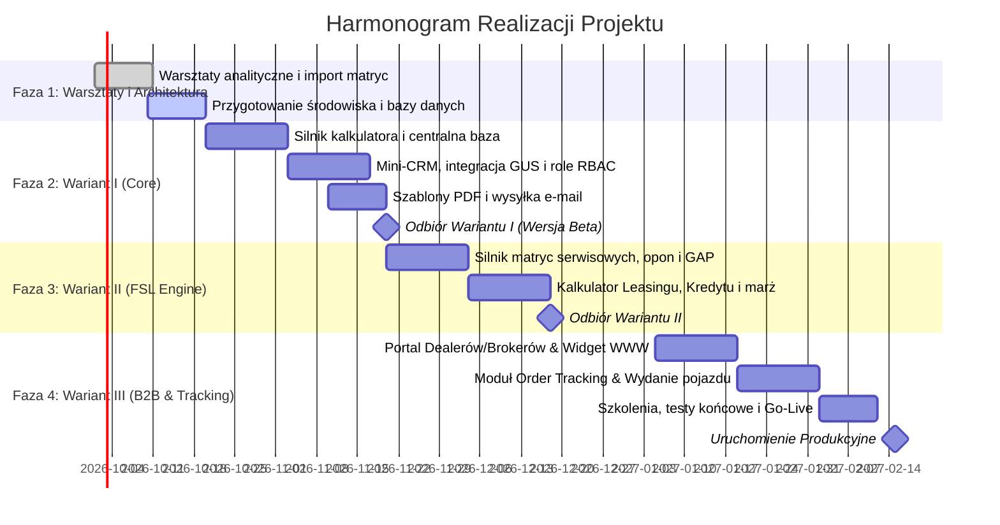

# OFERTA WDROŻENIOWA: SYSTEM KALKULATORA RENTALOWEGO I PORTALU B2B
## Cyfryzacja sprzedaży wynajmu (FSL), leasingu oraz obsługa sieci dealersko-brokerskiej

**Dokument:** Oferta biznesowo-techniczna  
**Data:** 16 września 2026 r.  
**Baza technologiczna:** Dedykowana platforma w oparciu o sprawdzony ekosystem technologiczny Car-Scout / Rental-Scout  

---

## 1. Executive Summary (Podsumowanie Menedżerskie)

Niniejsza oferta stanowi bezpośrednią odpowiedź na potrzeby digitalizacji i centralizacji procesów sprzedażowych w firmie najmowej oraz budowy nowoczesnego kanału dystrybucji dla sieci dealerskiej i brokerskiej.

Tradycyjny model oparty o arkusze kalkulacyjne (Excel) rodzi dziś krytyczne ryzyka operacyjne: rozproszone wersje stawek, brak kontroli nad marżowością, lokalne bazy klientów w posiadaniu poszczególnych handlowców oraz brak spójnego lejka sprzedaży.

Proponowane rozwiązanie opiera się na **gotowym, sprawdzonym w bojach silniku platformy Car-Scout / Rental-Scout**. Dzięki wykorzystaniu istniejącej architektury klient zyskuje:
1. **Skrócenie czasu wdrożenia (Time-to-Market) o ponad 60%** w stosunku do budowy systemu od zera.
2. **Niezrównaną elastyczność kalkulacyjną**: modularne łączenie czystego algorytmu finansowego (amortyzacja kapitału + stopa bazowa/marża + RV) z precyzyjnymi **matrycami kosztów serwisowych (R&M)**, **opon** oraz **ubezpieczeń (OC/AC/NNW, GAP)**.
3. **Wielokanałowość (Omnichannel)**: ten sam certyfikowany rdzeń obliczeniowy obsługuje wewnętrzny zespół sprzedaży, zewnętrznych brokerów/dealerów (portal partnerski) oraz klientów końcowych na stronie WWW (widget embed).
4. **Pełny cykl życia transakcji**: od pierwszej symulacji raty, przez wygenerowanie markowej oferty PDF i scoring wniosku, aż po śledzenie statusu zamówienia fabrycznego/magazynowego i protokół wydania pojazdu.

Oferta została sformułowana w **3 komplementarnych wariantach**, umożliwiających elastyczny dobór zakresu inwestycji i etapowe skalowanie.

---

## 2. Diagnoza Wyzwań i Wartość Biznesowa

| Stan obecny (Arkusz XLS / Proces ręczny) | Rozwiązanie w nowym systemie | Wartość biznesowa dla Zarządu |
|---|---|---|
| **Rozproszona wiedza i kalkulatory**: Każdy handlowiec posiada własną kopię pliku, z nieaktualnymi stawkami stóp (WIBOR), marż lub kosztów serwisu. | **Jeden centralny silnik kalkulacyjny w chmurze**: Natychmiastowa aktualizacja parametrów globalnych (stawki serwisowe, tabele RV, stopy bazowe) dla całej organizacji w 1 sekundę. | Eliminacja błędów ofertowania i zaniżonych marż. 100% spójności cenowej. |
| **Baza klientów na dyskach handlowców**: Ryzyko utraty kontaktów przy rotacji personelu, brak historii kontaktów i ofertowań. | **Centralny B2B Mini-CRM**: Wszystkie leady, firmy (NIP, REGON, GUS API), osoby decyzyjne i wygenerowane kalkulacje przypisane do firmy z historią audytową. | Ochrona majątku informacyjnego spółki. Ciągłość relacji z klientami. |
| **Czasochłonne przygotowanie oferty**: Ręczne formatowanie Word/PDF, błędy literowe, niespójny branding. | **Generator ofert PDF w 1 kliknięcie**: Spersonalizowana, estetyczna, markowa oferta PDF generowana w 2 sekundy z bezpośrednią wysyłką e-mail z aplikacji. | Skrócenie czasu reakcji na zapytanie z godzin do minut; profesjonalny wizerunek rynkowy. |
| **Brak widoczności lejka sprzedaży**: Kierownicy i zarząd nie widzą, na jakim etapie są kalkulacje, dlaczego oferty przepadają. | **Automatyczne raportowanie i analityka**: Pełny wgląd w pipeline, współczynniki konwersji, marże handlowców, wolumeny aut i statusy ofert. | Podejmowanie decyzji w oparciu o twarde dane w czasie rzeczywistym. |
| **Ograniczona współpraca z brokerami i dealerami**: Konieczność ręcznego przeliczania ofert zapytań spływających z rynku. | **Portal Partnerski B2B + Widget WWW**: Zewnętrzni partnerzy kalkulują oferty samodzielnie w ramach zdefiniowanych limitów marżowych. | Skalowanie sprzedaży zewnętrznej bez konieczności zatrudniania kolejnych handlowców wewnętrznych. |

---

## 3. Architektura Silnika Kalkulacyjnego (Rdzeń FSL & Multi-Product)

Kluczową przewagą oferowanego rozwiązania jest **architektura modułowa**, oddzielająca warstwę finansowania kapitałowego od czystych matryc kosztów eksploatacyjnych.

```
┌────────────────────────────────────────────────────────────────────────────────────────┐
│                        KONFIGURATOR PARAMETRÓW POJAZDU I ZAKUPU                       │
│     Cena katalogowa | Rabat dilerski | Cena zakupu netto | Okres (msc) | Przebieg km    │
└─────────────────────────────────────────┬──────────────────────────────────────────────┘
                                          │
                  ┌───────────────────────┴───────────────────────┐
                  ▼                                               ▼
   ┌─────────────────────────────┐                 ┌─────────────────────────────┐
   │     CZĘŚĆ FINANSOWA         │                 │   CZYSTE MATRYCE USŁUGOWE   │
   │   (Financial Engine)        │                 │        (Service Core)       │
   ├─────────────────────────────┤                 ├─────────────────────────────┤
   │ • Produkt: Wynajem / FSL    │                 │ 1. Matryca Serwisowa (R&M)  │
   │ • Produkt: Leasing operac.  │                 │    - stawka per klasa/grupa │
   │ • Produkt: Pożyczka/Kredyt  │                 │    - z uwzgl. km i okresu   │
   │ • Wpłata własna (% / PLN)   │       +         │ 2. Matryca Opon             │
   │ • Wartość Rezydualna (RV)   │                 │    - klasa opon (Econ/Prem) │
   │ • Stopa bazowa (WIBOR/EUR)  │                 │    - sezonowanie, hotel, wymi│
   │ • Marża finansowa / narzut  │                 │ 3. Matryca Ubezpieczeń      │
   │                             │                 │    - OC/AC/NNW (udział 500/0│
   │                             │                 │    - GAP Fakturowy          │
   └──────────────┬──────────────┘                 └──────────────┬──────────────┘
                  │                                               │
                  └───────────────────────┬───────────────────────┘
                                          │
                                          ▼
   ┌─────────────────────────────────────────────────────────────────────────────────────┐
   │                            REKAPITULACJA OFERTY (FSL / LEASING)                     │
   │               Rata finansowa netto + Rata usługowa netto = Rata łączna netto        │
   │                + Parametryzacja marży handlowca / prowizji brokera                 │
   │                + Generowanie profesjonalnej oferty PDF i wysyłka e-mail             │
   └─────────────────────────────────────────────────────────────────────────────────────┘
```

### 3.1. Szczegółowy zakres komponentów silnika:
1. **Moduł Finansowy (Financial Pricing Engine)**:
   - Amortyzacja liniowa lub finansowa z uwzględnieniem wartości końcowej (RV).
   - Tabela wartości rezydualnych (RV Matrix) powiązana z wiekiem, segmentem pojazdu i rocznym przebiegiem.
   - Dynamiczna stopa finansowania (WIBOR 1M/3M/EURIBOR + stała lub zmienna marża finansująca).
   - Obsługa różnych modeli finansowych: **Wynajem Długoterminowy (FSL)**, **Leasing Operacyjny**, **Leasing Finansowy**, **Kredyt / Pożyczka leasingowa**.
2. **Czysta Matryca Serwisowa (Repair & Maintenance - R&M)**:
   - Definiowanie stawek per km lub per macierz (okres / przebieg roczny).
   - Segmentacja pojazdów (np. Grupa A: miejskie, B: kompakt, C: D-segment, D: Premium, E: Dostawcze).
   - Rozróżnienie napędów (Benzyna, Diesel, HEV, PHEV, BEV) uwzględniające specyfikę kosztów przeglądów.
3. **Czysta Matryca Oponiarska (Tire Management)**:
   - Konfiguracja kompletów: letnie, zimowe, wielosezonowe.
   - Warianty: limity sztuk (np. 1 komplet na 40 tys. km) lub opcja No-Limit.
   - Dodatki: montaż/wyważanie, przechowalnia (hotel opon).
4. **Czysta Matryca Ubezpieczeniowa (Insurance Engine)**:
   - Pakiet komunikacyjny OC/AC/NNW/Assistance: wariant ze stałym udziałem własnym (np. 500 PLN) vs wariant bez udziału (zniesienie amortyzacji).
   - Ubezpieczenie straty finansowej GAP (fakturowy, finansowy, indeksowy) kalkulowany automatycznie od wartości początkowej pojazdu.
   - Zarządzanie marżą ubezpieczeniową i prowizją agencyjną.

---

## 4. Zakres Funkcjonalny Modułów Platformy

### Moduł 1: Centralny Kalkulator On-Line & Generator Ofert PDF
- **Kalkulator wielowariantowy**: natychmiastowe porównanie wariantów (np. 24, 36, 48 m-cy oraz 15 tys., 25 tys., 40 tys. km/rok) na jednym ekranie.
- **Konfigurator pakietu usług**: suwaki/przełączniki dla klienta: włącz/wyłącz ubezpieczenie, auto zastępcze, serwis pełny / podstawowy, opony premium / standard.
- **Generator ofert PDF (Server-side)**:
  - Elegancki, brandowany szablon z logotypem firmy, kolorystyką firmową i danymi doradcy.
  - Prezentacja specyfikacji pojazdu, zdjęcia, kalkulacji raty, zestawienia włączonych usług i wyliczenia kosztu nadprzebiegu (overmileage).
  - Generowanie klikalnego, zabezpieczonego pliku PDF w ułamku sekundy.
- **Bezpośrednia wysyłka E-mail**:
  - Wysyłka oferty PDF bezpośrednio z poziomu kalkulatora do klienta z predefiniowanym, profesjonalnym szablonem wiadomości.
  - Śledzenie otwarć i pobrań oferty (opcja audytowa).

### Moduł 2: Centralna Baza Kalkulacji & Mini-CRM
- **Baza kalkulacji**:
  - Unikalny numer każdej kalkulacji (np. `KAL/2026/09/00142`).
  - Wersjonowanie ofert (wariant A, B, C dla tego samego klienta bez nadpisywania).
  - Statusy: *Szkic, Wysłana, Negocjacje, Wniosek złożony, Zaakceptowana, Odrzucona, Wygasła*.
- **Mini-CRM B2B**:
  - Kartoteka Klienta: dane rejestrowe (integracja z bazą GUS po NIP – automatyczne zaciąganie nazwy, adresu, formy prawnej), osoby kontaktowe, historia ofert i rozmów.
  - Przypisanie klienta do dedykowanego opiekuna handlowego.
  - Szybkie klonowanie kalkulacji dla stałych klientów flotowych.

### Moduł 3: Role, Uprawnienia i Bezpieczeństwo Danych (RBAC)
- **Role w systemie**:
  - **Handlowiec / Doradca Klienta**: tworzenie kalkulacji, dostęp wyłącznie do swoich klientów i ofert, ograniczone widełki rabatowe/marżowe.
  - **Kierownik Regionalny / Team Leader**: wgląd we wszystkie kalkulacje i klientów podległego zespołu, możliwość akceptacji niestandardowych marż (proces akceptacji odstępstw / dyskonta).
  - **Dyrektor Sprzedaży / Administrator**: pełny dostęp do bazy w skali całego kraju, edycja stawek bazowych, matryc serwisowych, tabel ubezpieczeń i marż globalnych.
- **Dziennik Zdarzeń (Audit Log)**: pełna transparentność zmian i edycji ofert.

### Moduł 4: Raportowanie i Zarządzanie Lejkiem
- **Dashboard Menedżerski**:
  - Wolumen aktywnych kalkulacji i łączna wartość portfela w toku.
  - Współczynnik konwersji (z kalkulacji do sfinalizowanej umowy).
  - Średnia marża na pojeździe oraz udział produktów dodatkowych (penetracja ubezpieczeń, opon, GAP).
  - Ranking efektywności handlowców i oddziałów regionalnych.
- **Eksport danych**: raporty do plików Excel/CSV na żądanie.

### Moduł 5: Portal Partnerski dla Dealerów i Brokerów + Widget WWW
- **Portal B2B dla Partnerów**:
  - Dedykowany, bezpieczny panel logowania dla salonów dealerskich i niezależnych brokerów.
  - Możliwość przygotowywania kalkulacji na stawkach dealerskich z automatycznym uwzględnieniem prowizji partnerskiej.
  - White-label: możliwość wygenerowania oferty z podwójnym brandingiem (np. Logo Firmy Najmowej + Logo Dealera).
- **Widget Kalkulatora na stronę WWW**:
  - Responsywny komponent kalkulatora osadzalny na stronie internetowej firmy najmowej lub serwisach partnerów (iframe / Web Component).
  - Przechwytywanie leadów bezpośrednio do bazy CRM z oznaczeniem źródła pozyskania (atrybucja kanału).

### Moduł 6: Pipeline Śledzenia Zamówień (Order-to-Delivery Tracking)
- **Moduł Realizacji Transakcji (Order Fulfillment)**:
  - Automatyczne przekształcenie zaakceptowanej kalkulacji w aktywne zamówienie pojazdu.
  - Kamienie milowe procesu:
    1. *Złożenie zamówienia do dealera / fabryki* (rezerwacja slotu produkcyjnego, numer zamówienia fabrycznego).
    2. *Weryfikacja finansowa / scoring i podpisanie umowy*.
    3. *Produkcja i transport do placówki wydawczej*.
    4. *Rejestracja pojazdu i montaż akcesoriów / telematyki*.
    5. *Polisa ubezpieczeniowa i wydanie dokumentów*.
    6. *Protokół Wydania Pojazdu (Handover)* z podpisem i przekazaniem kluczyków.
- **Panel statusowy dla klienta i handlowca**: bieżący podgląd etapu dostawy redukujący zapytania telefoniczne o status auta.

---

## 5. Trzy Warianty Wdrożenia (Pakiety Ofertowe)

Dla zapewnienia maksymalnej elastyczności decyzyjnej przygotowaliśmy **trzy warianty wdrożenia**:

```
┌────────────────────────────────────────────────────────────────────────────────────────┐
│                                   WARIANT I                                            │
│                      CYFROWE BIURO SPRZEDAŻY (CORE RENTAL & CRM)                       │
│  Przejście z Excela do on-line • Baza kalkulacji • Mini-CRM • Oferty PDF i e-mail      │
│  Uprawnienia Handlowiec/Kierownik • Raporty sprzedaży                                 │
└────────────────────────────────────────────────────────────────────────────────────────┘
                                            │ +
┌───────────────────────────────────────────▼────────────────────────────────────────────┐
│                                   WARIANT II                                           │
│                     ZAAWANSOWANY SILNIK FSL & MULTI-PRODUCT                            │
│  Czyste matryce serwisowe (R&M), opon i ubezpieczeń • Finansowanie: Wynajem/Leasing/   │
│  Kredyt • Elastyczne modelowanie marż • Zaawansowany konfigurator ofert PDF            │
└────────────────────────────────────────────────────────────────────────────────────────┘
                                            │ +
┌───────────────────────────────────────────▼────────────────────────────────────────────┐
│                                   WARIANT III                                          │
│                   EKOSYSTEM B2B: DEALERZY, BROKERZY & ORDER TRACKING                   │
│  Dedykowany Portal dla Dealerów i Brokerów • Widget WWW na stronę • Śledzenie          │
│  zamówienia od fabryki do wydania auta klientowi (Order-to-Delivery)                   │
└────────────────────────────────────────────────────────────────────────────────────────┘
```

### Wariant I: Cyfrowe Biuro Sprzedaży (Core Rental & CRM)
*Cel: Błyskawiczne wycofanie Excela, scentralizowanie bazy klientów i kalkulacji, automatyzacja ofertowania.*
- **Zakres**:
  - Dedykowany system on-line w chmurze (dostęp przez przeglądarkę na komputerach i tabletach).
  - Jednolity kalkulator rentalowy z predefiniowaną matrycą stawek.
  - Centralna baza kalkulacji z wyszukiwarką, filtrami i wersjonowaniem.
  - Zintegrowany Mini-CRM (baza firm z pobieraniem z GUS po NIP, historia kontaktów, przypisanie opiekunów).
  - Generator profesjonalnych ofert PDF z logotypem firmy i specyfikacją auta.
  - Moduł bezpośredniej wysyłki ofert na e-mail klienta.
  - Struktura uprawnień RBAC (Handlowiec widzi swoje, Kierownik widzi zespół/region, Administrator widzi całość).
  - Podstawowe raportowanie sprzedaży (aktywność, konwersja, liczba kalkulacji).
- **Czas realizacji**: 4 - 6 tygodni.
- **Dla kogo**: Idealny punkt startowy dla natychmiastowego uporządkowania i zabezpieczenia procesów handlowych.

---

### Wariant II: Zaawansowany Silnik FSL & Multi-Product (Rekomendowany)
*Cel: Budowa pełnego silnika kalkulacyjnego CFM łączącego finanse z dynamicznymi matrycami usług.*
- **Zakres**:
  - **Wszystkie funkcjonalności Wariantu I**, oraz dodatkowo:
  - **Modularny Silnik Produktów Finansowych**:
    - Obsługa Wynajmu Długoterminowego (FSL), Leasingu Operacyjnego, Leasingu Finansowego oraz Kredytu/Pożyczki.
    - Elastyczne zarządzanie wartościami końcowymi (Residual Value - RV) i stopami bazowymi (WIBOR/marża).
  - **System Czystych Matryc Usługowych**:
    - Dedykowany moduł kosztów serwisowych (R&M) wg segmentów, przebiegów i napędów.
    - Matryca oponiarska (zakup, limity, hotel opon, serwis sezonowy).
    - Matryca ubezpieczeniowa (OC/AC/NNW z wariantami franszyz oraz ubezpieczenie GAP).
  - **Matryca Marż i Prowizji**: zaawansowane reguły narzutów kwotowych i procentowych z systemem akceptacji upustów przez Kierowników.
  - **Wielowariantowy Generator PDF**: możliwość wygenerowania na jednym dokumencie zestawienia porównawczego (np. 3 różne okresy lub opcje z/bez serwisu).
  - **Rozbudowany Dashboard Analityczny**: rentowność poszczególnych produktów, zyskowność na serwisie i ubezpieczeniach.
- **Czas realizacji**: 8 - 10 tygodni.
- **Dla kogo**: Dla organizacji, które chcą dynamicznie kreować ofertę produktową, optymalizować marże i precyzyjnie kontrolować koszty FSL.

---

### Wariant III: Ekosystem B2B: Portal Dealerów/Brokerów & Order Tracking (Kompleksowy)
*Cel: Stworzenie potężnej platformy sprzedaży wielokanałowej i pełnej cyfryzacji łańcucha dostaw.*
- **Zakres**:
  - **Wszystkie funkcjonalności Wariantu I oraz Wariantu II**, oraz dodatkowo:
  - **Portal Partnerski dla Dealerów i Brokerów (B2B Partner Hub)**:
    - Osobna strefa logowania dla partnerów zewnętrznych z subkontami.
    - Dedykowane cenniki, poziomy prowizyjne i ograniczone uprawnienia (partner widzi tylko swoje oferty).
    - Mechanizm co-brandingu na ofertach PDF (logo partnera obok firmy najmowej).
  - **Widget Kalkulatora WWW (Public Lead Engine)**:
    - Lekki komponent do osadzenia na oficjalnej stronie www firmy najmowej lub stronach dealerów.
    - Generowanie wstępnych kalkulacji przez klientów i automatyczne przekazywanie leadu do CRM.
  - **Moduł Śledzenia Zamówień (Order Fulfillment & Handover Tracking)**:
    - Zarządzanie cyklem życia transakcji od podpisania umowy do wydania kluczyków (rezerwacja, zamówienie w fabryce, rejestracja, ubezpieczenie, logistyka).
    - Generowanie elektronicznego Protokołu Zdawczo-Odbiorczego / Wydania Pojazdu.
    - Powiadomienia SMS / E-mail o zmianie statusu realizacji pojazdu.
- **Czas realizacji**: 12 - 14 tygodni.
- **Dla kogo**: Dla liderów rynku celujących w szeroką ekspansję przez sieć brokerską i automatyzację logistyki wydań.

---

## 6. Zestawienie Porównawcze Wariantów

| Funkcjonalność / Moduł | Wariant I (Core CRM) | Wariant II (FSL Engine) [Rekomendowany] | Wariant III (B2B Omnichannel) |
|---|:---:|:---:|:---:|
| **Kalkulator on-line (wycofanie Excela)** | TAK | TAK | TAK |
| **Centralna baza kalkulacji i wersjonowanie** | TAK | TAK | TAK |
| **Baza klientów (Mini-CRM z integracją GUS)** | TAK | TAK | TAK |
| **Generowanie i wysyłka ofert PDF e-mailem** | TAK (Standard) | TAK (Wielowariantowy) | TAK (Multi-brand/Partner) |
| **Uprawnienia: Handlowiec, Kierownik, Admin** | TAK | TAK | TAK |
| **Raportowanie sprzedaży i lejka** | Podstawowe | Zaawansowane (marże) | Pełne (partnerzy + logistyka) |
| **Silnik Produktów (Wynajem, Leasing, Kredyt)** | Ograniczony (Najem) | TAK | TAK |
| **Czysta matryca serwisowa (R&M)** | NIE | TAK | TAK |
| **Matryca oponiarska i ubezpieczeń (GAP/AC)** | NIE | TAK | TAK |
| **Portal dla Zewnętrznych Dealerów i Brokerów** | NIE | NIE | TAK |
| **Widget kalkulatora na stronę WWW** | NIE | NIE | TAK |
| **Śledzenie zamówienia do wydania (Tracking)** | NIE | NIE | TAK |
| **Szacowany czas wdrożenia (MVP)** | **4-6 tyg.** | **8-10 tyg.** | **12-14 tyg.** |

---

## 7. Plan Realizacji i Metodyka Wdrożenia

Wdrożenie realizowane jest w metodyce **Agile / Iteracyjnej**, z regularnymi demonstracjami działającego oprogramowania co 2 tygodnie (sprinty):



---

## 8. Warunki Finansowe i Modele Współpracy

Oferujemy transparentny model rozliczenia bazujący na zdefiniowanym zakresie (Fixed-Price) lub etapowym uruchamianiu modułów:

### 8.1. Szacunek Kosztów Wdrożenia (Prace Programistyczne i Konfiguracyjne):

| Wariant Wdrożenia | Zakres | Budżet Wdrożenia (Netto) |
|---|---|:---:|
| **Wariant I: Cyfrowe Biuro Sprzedaży** | Pkt 1 z briefu: Kalkulator on-line, Baza kalkulacji, Mini-CRM, Oferty PDF/Email, Uprawnienia, Raporty | **36 000 – 48 000 PLN** |
| **Wariant II: Zaawansowany FSL Engine** *(Rekomendowany)* | Zakres Wariantu I + Pełny silnik FSL, czyste matryce serwisowe (R&M), opon, ubezpieczeń (GAP), leasing/kredyt, elastyczne marże | **65 000 – 82 000 PLN** |
| **Wariant III: Ekosystem B2B Omnichannel** | Pełen zakres Wariantów I i II + Portal Dealerów/Brokerów, Widget WWW, Moduł śledzenia zamówień do momentu wydania auta | **98 000 – 125 000 PLN** |

*Podane kwoty są wartościami netto (+ 23% VAT). Istnieje możliwość płatności w transzach powiązanych z kamieniami milowymi (Milestone-based).*

### 8.2. Koszty Utrzymania, Infrastruktury i SLA (Opcjonalnie):
- **Pakiet Utrzymaniowo-Rozwojowy (SLA & Cloud Hosting)**:
  - Dedykowane, skalowalne środowisko w chmurze (PostgreSQL, Redis, szybkie generowanie PDF).
  - Codzienne automatyczne kopie zapasowe (backupy 30 dni).
  - Gwarancja ciągłości działania (SLA 99.7%) i czas reakcji krytycznej < 4h.
  - Pakiet godzin programistycznych w miesiącu na bieżący rozwój i aktualizację matryc.
  - Koszt: **2 400 – 3 800 PLN netto / miesiąc** (w zależności od wybranego wariantu i SLA).

---

## 9. Dlaczego Nasz Zespół?

1. **Gotowe komponenty motoryzacyjne**: Nie zaczynamy od zera. Dysponujemy gotowymi modułami dekodowania pojazdów, obsługi matryc leasingowych i rentalowych oraz architekturą przetestowaną na tysiącach transakcji.
2. **Doświadczenie CFM i FSL**: Rozumiemy specyfikę branży wynajmu - wiemy, czym różni się czysta rata finansowa od budżetu na opony i jak poprawnie zarządzać wartością rezydualną oraz ryzykiem serwisowym.
3. **Nowoczesny Stack Technologiczny**: Fastify, React, TypeScript, PostgreSQL - gwarancja błyskawicznego działania interfejsu (subsekundowe kalkulacje), bezpieczeństwa i braku długu technologicznego na lata.

---

## 10. Następne Kroki

W celu doprecyzowania parametrów wdrożenia proponujemy:
1. **Krótkie 45-minutowe spotkanie warsztatowe (on-line)** w celu weryfikacji struktury bieżącego pliku Excel (arkusza kalkulacyjnego) oraz zdefiniowania priorytetowych matryc serwisowych.
2. **Wybór optymalnego wariantu** (I, II lub III) bądź uzgodnienie ścieżki etapowej (np. Start z Wariantem I i płynne przejście do II/III).
3. **Przygotowanie umowy wdrożeniowej i start prac projektowych**.
